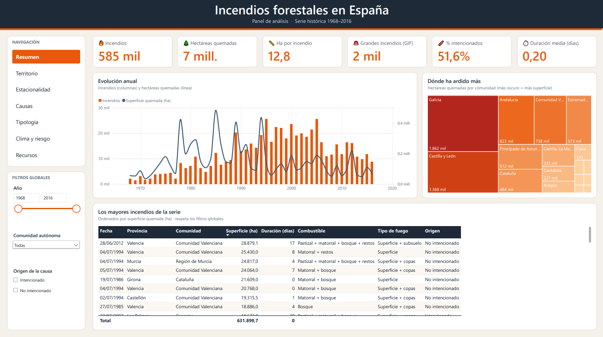
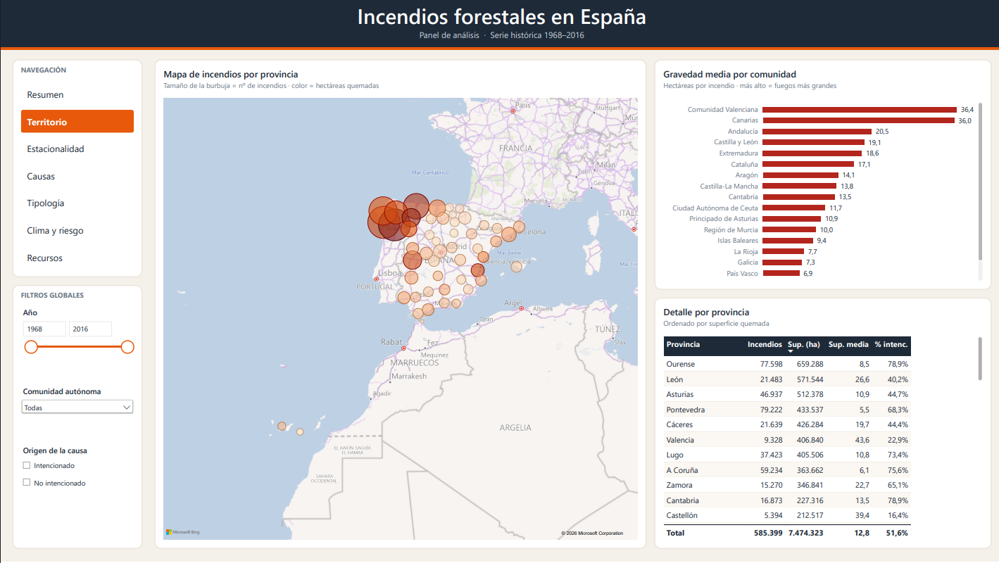
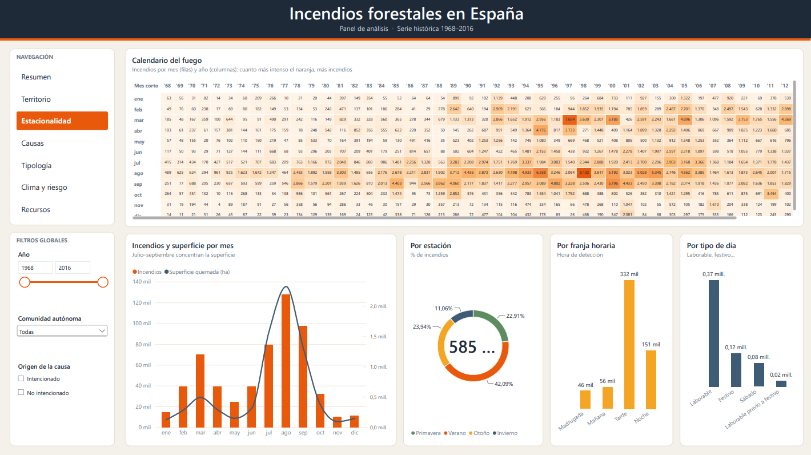
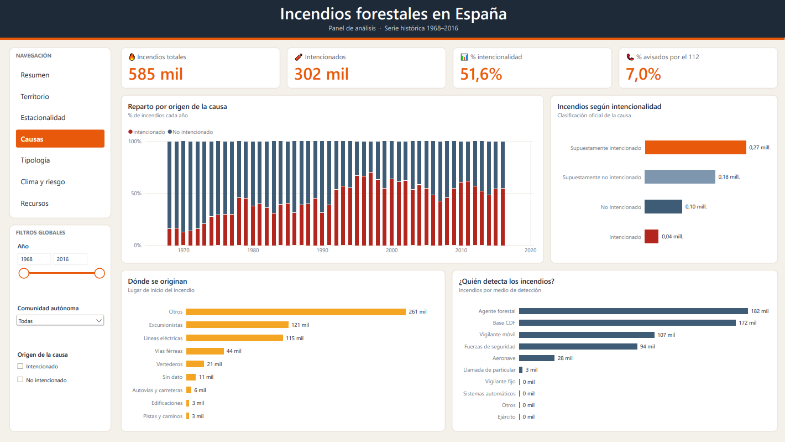
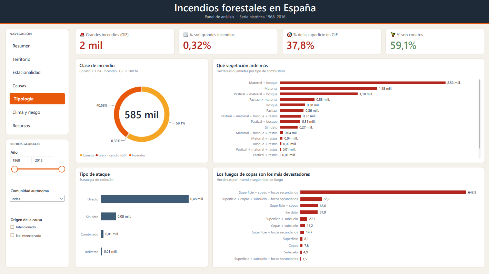
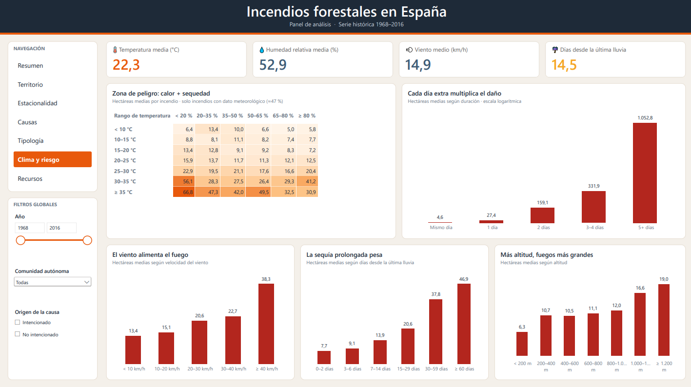
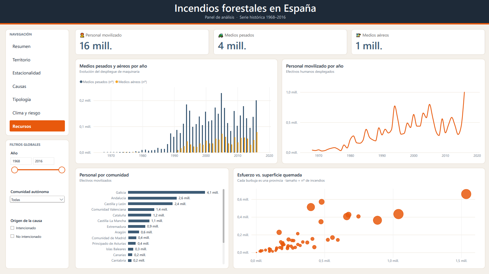

# Incendios forestales en España · Dashboard en Power BI

Panel interactivo de análisis de **585.399 incendios forestales en España entre 1968 y 2016**. Explora dónde, cuándo y por qué arden los montes, qué los hace crecer y cuántos recursos se movilizan para apagarlos.

> Proyecto de visualización de datos desarrollado en Power BI (formato PBIP/TMDL/PBIR, versionable con Git).



## ✨ Qué incluye

El dashboard tiene **7 páginas** con una barra lateral común: navegación entre páginas y **filtros globales sincronizados** (Año, Comunidad autónoma y Origen de la causa).

| Página                | Qué responde                  | Visuales destacados                                                                                           |
| --------------------- | ----------------------------- | ------------------------------------------------------------------------------------------------------------- |
| 🏠 **Resumen**        | ¿Cuál es el panorama general? | 6 KPIs, evolución anual (columnas + línea), treemap por comunidad, tabla de los mayores incendios             |
| 🗺️ **Territorio**     | ¿Dónde arde más?              | Mapa de burbujas por provincia, gravedad media por comunidad, tabla de detalle                                |
| 📅 **Estacionalidad** | ¿Cuándo ocurren?              | _Calendario del fuego_ (matriz de calor mes × año), incendios por mes, estación, franja horaria y tipo de día |
| 🧨 **Causas**         | ¿Por qué empiezan?            | Reparto por origen de la causa a lo largo del tiempo, intencionalidad, lugar de inicio, medio de detección    |
| 🌲 **Tipología**      | ¿Qué tipo de incendio es?     | Conatos vs. incendios vs. grandes incendios (GIF), combustible, tipo de fuego y de ataque                     |
| 🌡️ **Clima y riesgo** | ¿Qué condiciones los agravan? | Matriz temperatura × humedad, efecto de la duración, el viento, los días sin lluvia y la altitud              |
| 🚒 **Recursos**       | ¿Cuánto esfuerzo requieren?   | Personal, medios pesados y aéreos por año y comunidad, esfuerzo vs. superficie quemada por provincia          |

## 🔎 Qué se aprecia en los datos

- **Galicia** concentra el mayor número de incendios y la mayor superficie quemada acumulada de la serie.
- La superficie media por incendio **crece de forma muy marcada con la duración**: los que se prolongan varios días queman órdenes de magnitud más que los extinguidos el mismo día.
- La combinación de **temperaturas altas y humedad baja** (y el viento fuerte) se asocia con fuegos más grandes.
- La mayor parte de los incendios son conatos; una fracción mínima son grandes incendios, pero acumulan una parte desproporcionada de la superficie.

> Son observaciones descriptivas sobre datos con cobertura desigual, no relaciones causales.

## 🧱 Modelo de datos

Modelo en estrella sencillo, con importación desde CSV:

- **`incendios`**: tabla de hechos (una fila por incendio) con las variables limpiadas y etiquetadas en Power Query.
- **`Dim_Calendario`**: calendario generado con DAX (año, mes, trimestre, estación).
- **`_Medidas`**: medidas DAX (incendios, hectáreas, superficie media, % intencionalidad, grandes incendios, personal y medios, medias meteorológicas…).

Transformaciones destacadas en Power Query:

- Traducción de códigos y categorías a etiquetas legibles (provincias, causas, combustible, tipo de fuego…).
- Descarte de **valores imposibles** (por ejemplo, temperaturas de más de 2.000 °C o humedades superiores al 100 %).
- Discretización en rangos ordenados (temperatura, humedad, viento, días sin lluvia, altitud, duración) para las matrices de la página _Clima y riesgo_.

## ⚠️ Limitaciones de los datos

- Las variables **meteorológicas** (temperatura, humedad, viento, días sin lluvia) solo están informadas en torno al **47 %** de los incendios; las gráficas de la página _Clima y riesgo_ se calculan solo con los registros que tienen dato.
- Las coordenadas faltan en ~12 % de los registros, por lo que el mapa agrega por provincia.
- La serie termina en 2016: no refleja las temporadas más recientes.

## 🚀 Cómo abrirlo

**Requisitos:** Power BI Desktop (versión reciente de Windows).

1. Clona el repositorio en una **ruta corta y sin acentos** (por ejemplo `C:\pbi\`).
2. Activa en Power BI Desktop, en _Archivo > Opciones > Características en versión preliminar_:
   - Proyecto de Power BI (.pbip)
   - Almacenar modelo semántico con formato TMDL
   - Almacenar informe con formato mejorado de metadatos de Power BI (PBIR)

   y reinicia Desktop.

3. Descarga el dataset completo (ver sección siguiente) y guárdalo como `incendios.csv` en la raíz del proyecto.
4. Abre `dashboard_incendios.pbip`.
5. En _Transformar datos > Administrar parámetros_, cambia **`RutaCSV`** a la ruta de tu `incendios.csv`.
6. Pulsa **Actualizar**.

## 📦 Datos

El CSV completo (≈ 158 MB, 51 columnas, separador `;`) llamado incendios.csv corresponden a
registros históricos del EGIF (1968-2016)

## 🗂️ Estructura del repositorio

```text
dashboard_incendios/
├── dashboard_incendios.pbip              # Punto de entrada del proyecto
├── dashboard_incendios.Report/           # Informe (PBIR): páginas, visuales y tema
│   ├── definition/pages/                 # Una carpeta por página, con sus visuales en JSON
│   └── StaticResources/                  # Tema personalizado «FuegoES» (paleta)
├── dashboard_incendios.SemanticModel/    # Modelo semántico (TMDL): tablas, medidas, relaciones
├── data/incendios.csv                    # Los datos utilizados por el dashboard
├── docs/img/                             # Capturas para este README
└── README.txt                            # Instrucciones rápidas de apertura
```

## 🎨 Diseño

Paleta «FuegoES»: carbón `#1E2A38`, brasa `#E8590C`, ámbar `#F5A524`, azul pizarra `#3E5C76`, carmesí `#B3261E` y verde salvia `#5E8C61` sobre un fondo arena `#F4F0EA`. Los colores tienen significado consistente (por ejemplo, el carmesí marca gravedad o intencionalidad en todas las páginas).

## 🖼️ Capturas

| Territorio                                | Estacionalidad                                    |
| ----------------------------------------- | ------------------------------------------------- |
|  |  |

| Causas                            | Tipología                               |
| --------------------------------- | --------------------------------------- |
|  |  |

| Clima y riesgo                           | Recursos                              |
| ---------------------------------------- | ------------------------------------- |
|  |  |

## 🛠️ Tecnologías

Power BI (PBIP · TMDL · PBIR) · Power Query (M) · DAX

## 👤 Autor

**Lucas Miralles** · [@lucasmr19](https://github.com/lucasmr19)

## 📄 Licencia
